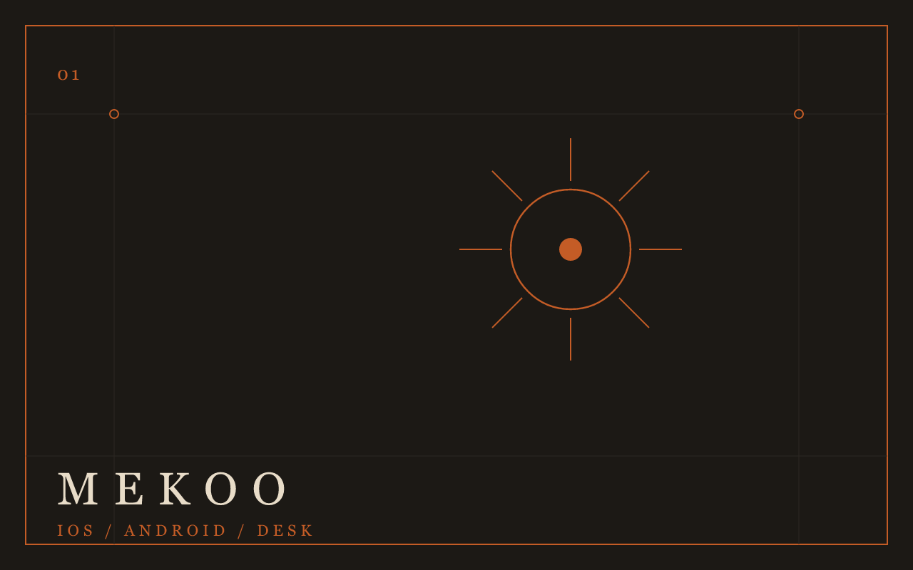
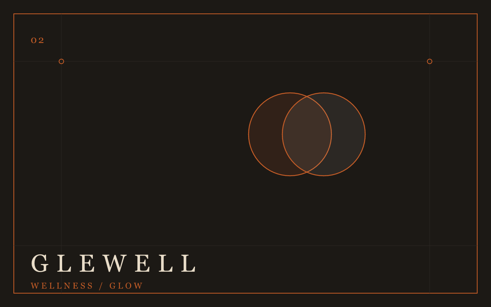
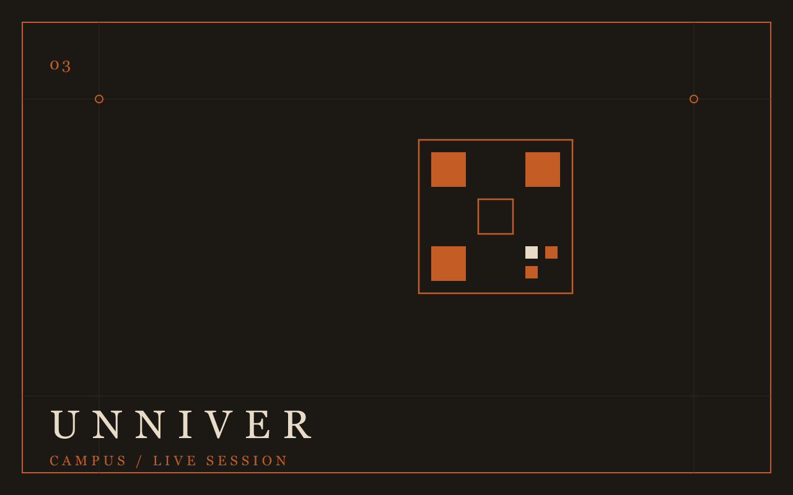
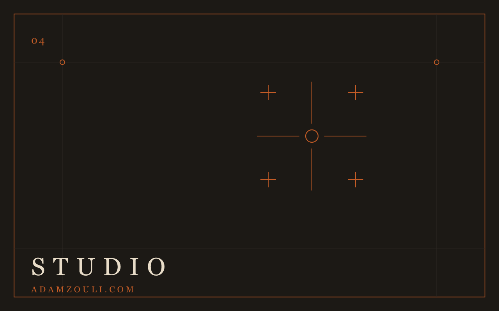
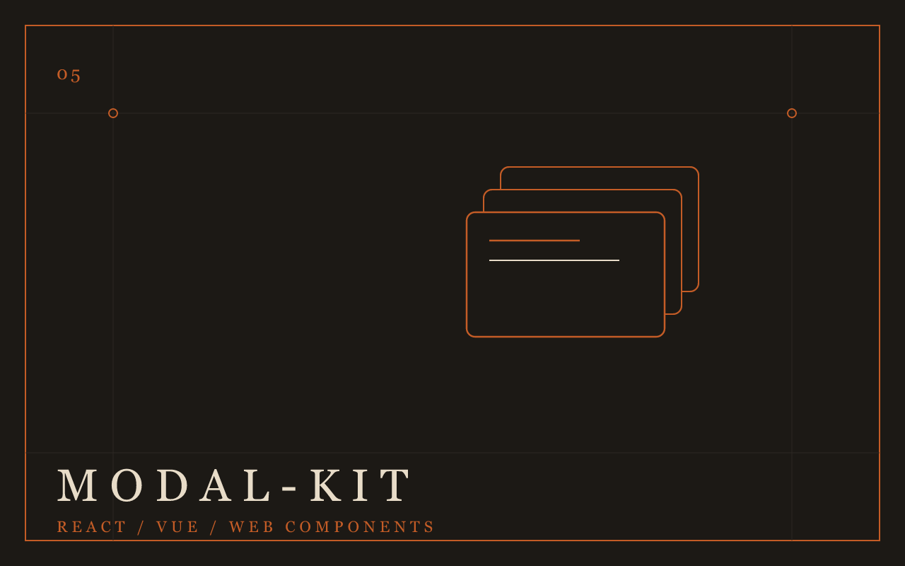
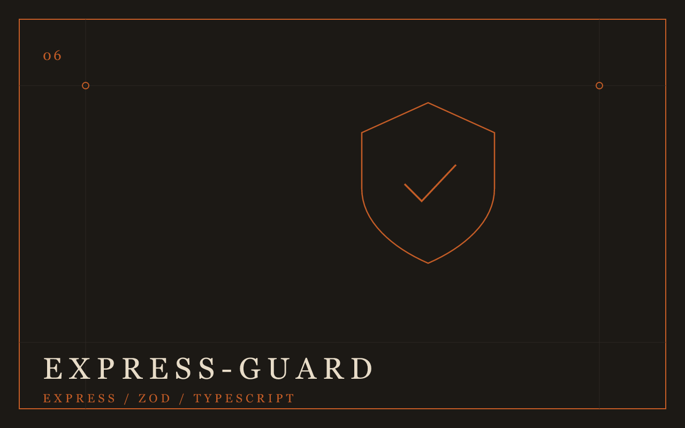

  

 

  
  
  
  

 

  

  I design the product, then I ship the first version you can actually open.

  

<table>
  <tr>
    <td width="50%" valign="top">
      
      

        Nearby places, a map, Bulo, a table, food before you walk in, and a restaurant board that has to keep up.
      

    </td>
    <td width="50%" valign="top">
      
      

        Nutrition, fitness, coaching, health, community. One app instead of five. Glow already has the logs and runs the day.
      

    </td>
  </tr>
  <tr>
    <td width="50%" valign="top">
      
      

        Attendance in about ten seconds. QR and PIN on the projector, check-in on the phone, rotating codes, campus Wi-Fi.
      

    </td>
    <td width="50%" valign="top">
      
      

        The paper portfolio. Products, calls, and the work in one place.
      

    </td>
  </tr>
</table>

  

<table>
  <tr>
    <td width="50%" valign="top">
      
      

        Accessible modal engine. Core, themes, confirm presets. React, Vue, Web Components. Same behavior.
         
        
        
      

    </td>
    <td width="50%" valign="top">
      
      

        Type-safe Express validation with Zod. Body, query, params, headers. <code>req.valid</code> matches the schema. ESM + CJS.
      

    </td>
  </tr>
</table>

 

  

  
  
  
  
  
  
  
  
  
  
  
  
  
  
  
  
  
  
  
  
  
  
  
  
  
  
  
  
  
  
  
  
  
  
  

 

  
  

    
      <a href="https://adamzouli.com">adamzouli.com</a>
      ·
      <a href="mailto:adamzouli20@gmail.com">adamzouli20@gmail.com</a>
      ·
      Sakarya
    
  

